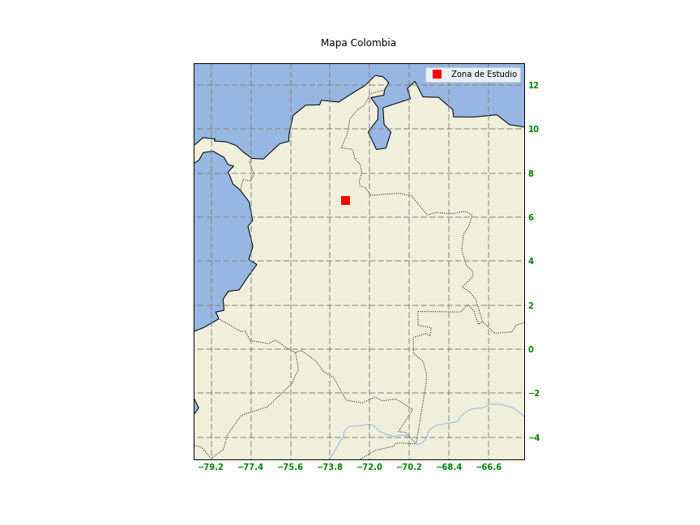
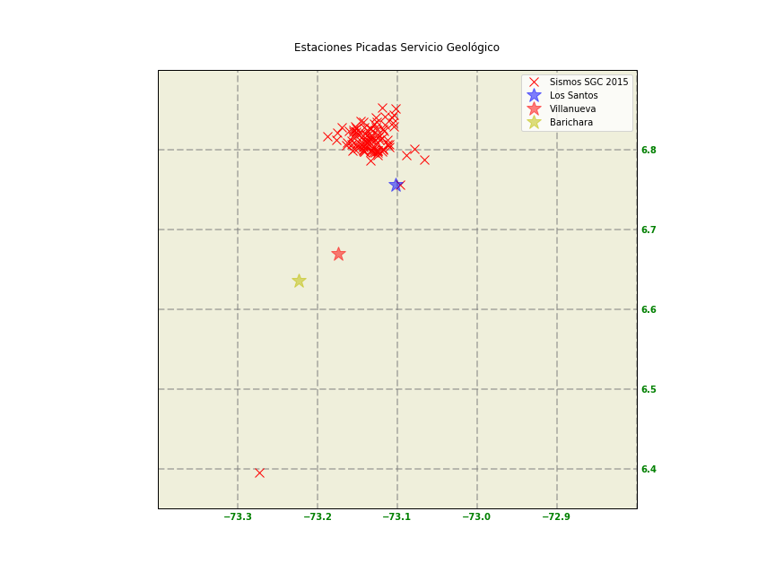
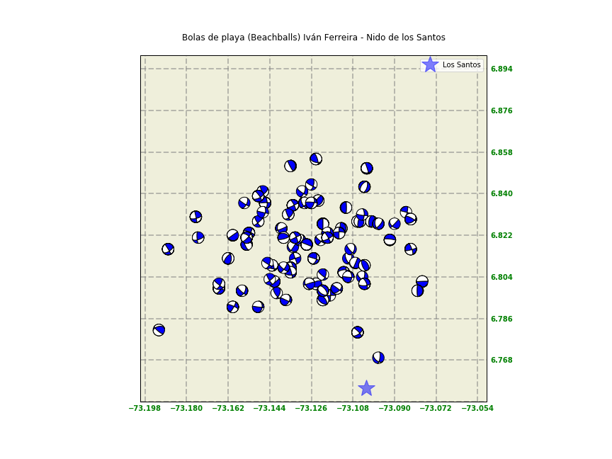
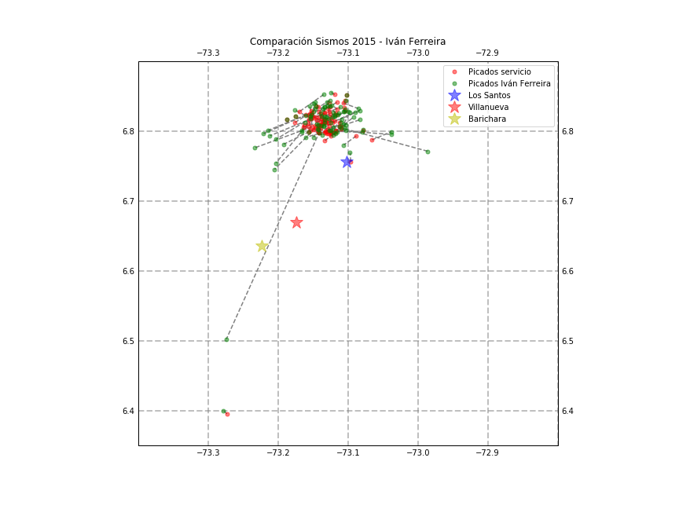

# Beachballs (Focal Mechanism) and Earthquake Visualization (Colombia, Bucaramanga Nest during the year 2015)

Jupyter notebook (TrabajoSismologiaCodigo.ipynb) which uses Earthquake data from 2015 in the Bucaramanga Nest (downloaded from the _Red Sismológica Nacional de Colombia_ or RSNC) the data is in the sgcSismos.xlsx file; additonally I manually picked the Earthquakes and saved it in another file (misSismos.xlsx), this file has the Focal Mechanisms calculated with Seisan (Strike SIR, DIP and Rake RAK).

Area on which the Earthquakes were analyzed.

Important Earthquakes during 2015 in the Bucaramanga Nest (RSNC)

Beachballs (Centered in the nest) generated with manually picked data on Seisan

Comparison between the earthquakes I picked and the Earthquakes picked by the RSNC.

